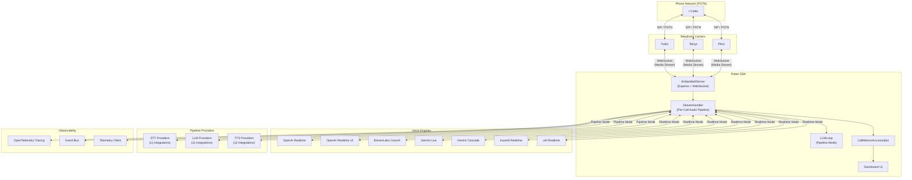
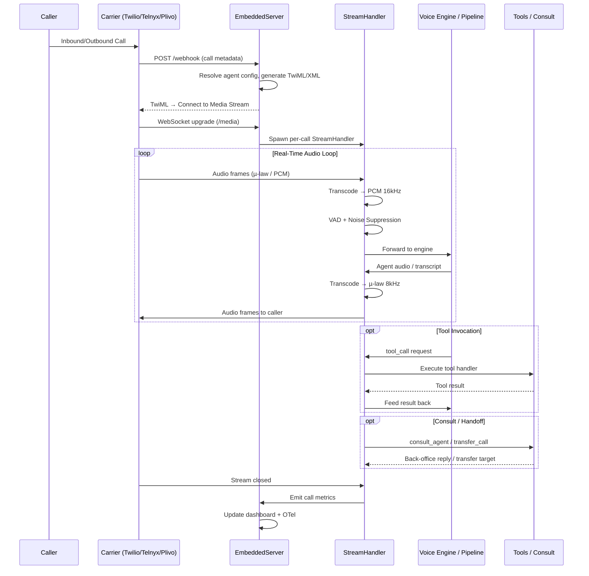
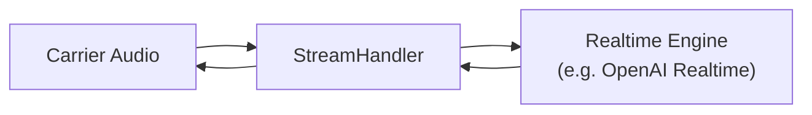
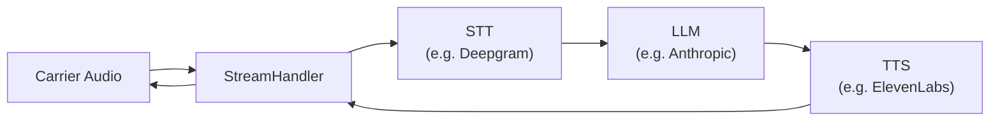
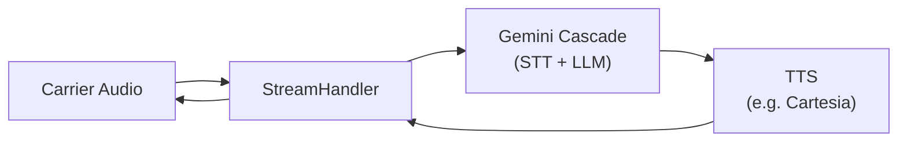
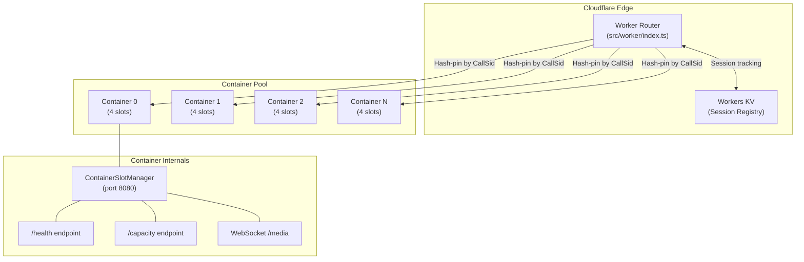

<p align="center">
  <picture>
    <source media="(prefers-color-scheme: dark)" srcset="https://raw.githubusercontent.com/PatterAI/Patter/main/docs/github-banner.png" />
    <source media="(prefers-color-scheme: light)" srcset="https://raw.githubusercontent.com/PatterAI/Patter/main/docs/github-banner.png" />
    
  </picture>
</p>

<h1 align="center">Patter SDK</h1>

<p align="center">
  <a href="https://pypi.org/project/getpatter/"></a>
  <a href="https://www.npmjs.com/package/getpatter"></a>
  <a href="./LICENSE"></a>
  
  
</p>

<p align="center">
  <a href="#about">About</a> •
  <a href="#architecture">Architecture</a> •
  <a href="#how-it-works">How It Works</a> •
  <a href="#voice-modes">Voice Modes</a> •
  <a href="#provider-matrix">Providers</a> •
  <a href="#infrastructure">Infrastructure</a> •
  <a href="#quickstart">Quickstart</a> •
  <a href="#documentation">Docs</a> •
  <a href="#templates">Templates</a>
</p>

---

## About

**Patter** is the open-source SDK that gives your AI agent a phone number. You build the agent; Patter handles everything between it and the phone network — the agent loop, the language model, speech-to-text, text-to-speech, real-time voice, audio processing, and the telephony carrier.

- **Build** with one API in [Python](https://pypi.org/project/getpatter/) or [TypeScript](https://www.npmjs.com/package/getpatter) — same surface, same hooks, same events, at full parity.
- **Choose** the provider for every layer — LLM, STT, TTS, realtime engine, carrier — and swap any of them with one line.
- **Run** locally with a built-in tunnel and dashboard, or simulate a whole call from your terminal — no phone required.

---

## Architecture

### High-Level System Overview



### Call Lifecycle Flow



---

## How It Works

Patter is the **full voice stack** between your application and the phone network — not just glue between an LLM and a carrier. It runs the agent loop and owns every layer of the call, and **you pick the provider for each one**. Compose them in **Realtime**, **Pipeline**, or **Hybrid** mode.

> **50+ provider integrations across the voice stack · 3 voice modes · 2 SDKs (Python & TypeScript) at parity.**

---

## Voice Modes

### Realtime Mode (Default)

The voice engine (e.g. OpenAI Realtime, Gemini Live) handles **STT → LLM → TTS** in a single WebSocket connection. Ultra-low latency. Best for natural conversational agents.



### Pipeline Mode

You compose **separate** STT, LLM, and TTS providers. Full control over each layer. Use `onMessage` for custom LLM logic or let the built-in `LLMLoop` handle it.



### Hybrid Mode (Gemini Cascade)

Gemini handles text generation; a separate TTS provider streams the audio. Combines Gemini's reasoning with premium TTS voices.



---

## Provider Matrix

### Speech-to-Text (STT) — 11 Providers

| Provider | Module | Streaming | Notes |
|---|---|---|---|
| Deepgram | `DeepgramSTT` | ✅ | Default. Nova-2, endpointing control |
| Deepgram Flux | `DeepgramFluxSTT` | ✅ | Cloudflare Workers AI (`@cf/deepgram/flux`) |
| AssemblyAI | `AssemblyAISTT` | ✅ | Universal-2 |
| Cartesia | `CartesiaSTT` | ✅ | Sonic model |
| Soniox | `SonioxSTT` | ✅ | Low-latency |
| Speechmatics | `SpeechmaticsSTT` | ✅ | Operating point control |
| Whisper | `WhisperSTT` | ❌ | OpenAI Whisper (batch) |
| OpenAI Transcribe | `OpenAITranscribeSTT` | ✅ | GPT-4o transcription |
| Fish Audio | `FishAudioSTT` | ✅ | Multi-language |
| Gemini | `GeminiSTT` | ✅ | Google Gemini |
| xAI | `XaiSTT` | ✅ | Grok-powered |

### Text-to-Speech (TTS) — 12 Providers

| Provider | Module | Streaming | Notes |
|---|---|---|---|
| ElevenLabs | `ElevenLabsTTS` | ✅ | HTTP REST or WebSocket variants |
| ElevenLabs WS | `ElevenLabsWebSocketTTS` | ✅ | Persistent WebSocket, lowest latency |
| OpenAI | `OpenAITTS` | ✅ | HD voices |
| Cartesia | `CartesiaTTS` | ✅ | Sonic, ultra-low latency |
| LMNT | `LMNTTTS` | ✅ | Custom voice cloning |
| Rime | `RimeTTS` | ✅ | Enterprise-grade |
| Soniox | `SonioxTTS` | ✅ | Multi-language |
| Sarvam | `SarvamTTS` | ✅ | Indian languages |
| Fish Audio | `FishAudioTTS` | ✅ | REST + WebSocket |
| Inworld | `InworldTTS` | ✅ | Game/character voices |
| Gemini | `GeminiTTS` | ✅ | Google TTS |
| xAI | `XaiTTS` | ✅ | Grok-powered |

### LLM Providers — 11 Integrations

| Provider | Module | Notes |
|---|---|---|
| OpenAI | `OpenAILLM` | GPT-4o, GPT-4o-mini |
| Anthropic | `AnthropicLLM` | Claude 3.5/4 |
| Google | `GoogleLLM` | Gemini models |
| Groq | `GroqLLM` | Ultra-fast inference |
| Cerebras | `CerebrasLLM` | Wafer-scale inference |
| Hermes | `HermesLLM` | Local Hermes runtime |
| OpenClaw | `OpenClawLLM` | OpenClaw agents |
| LiteLLM | `LiteLLMLLM` | Universal proxy (100+ models) |
| Inworld | `InworldLLM` | Character AI |
| Custom | `CustomLLM` | Any OpenAI-compatible endpoint (Ollama, vLLM, LM Studio) |
| OpenAI Compatible | `OpenAICompatibleLLM` | Generic OpenAI-protocol gateway |

### Realtime / Voice Engines — 7 Engines

| Engine | Module | Notes |
|---|---|---|
| OpenAI Realtime | `OpenAIRealtime` | GPT-4o-realtime, native audio |
| OpenAI Realtime v2 | `OpenAIRealtime2` | Latest realtime API |
| ElevenLabs ConvAI | `ElevenLabsConvAI` | Conversational AI |
| Gemini Live | `GeminiLive` | Google multimodal |
| Gemini Cascade | `GeminiCascade` | Gemini + separate TTS |
| Inworld Realtime | `InworldRealtime` | Character/game voice |
| xAI Realtime | `XaiRealtime` | Grok voice |

### Telephony Carriers — 3 Carriers

| Carrier | Module | Inbound | Outbound | AMD | Transfer |
|---|---|---|---|---|---|
| Twilio | `Twilio` | ✅ | ✅ | ✅ | ✅ |
| Telnyx | `Telnyx` | ✅ | ✅ | ✅ | ✅ |
| Plivo | `Plivo` | ✅ | ✅ | ✅ | ✅ |

### Audio Processing

| Feature | Module | Notes |
|---|---|---|
| Silero VAD | `SileroVAD` | ONNX voice activity detection |
| TenVAD | `TenVAD` | High-perf acoustic VAD |
| Smart Turn v3 | `SmartTurnDetector` | ONNX end-of-utterance |
| NAMO Turn v1 | `NamoTurnDetector` | Text-based EOU (Apache-2.0) |
| TurnSense | `TurnSenseDetector` | Hybrid text+audio classifier |
| DeepFilterNet | `DeepFilterNetFilter` | Noise suppression (ONNX) |
| Krisp | `KrispVivaFilter` | Enterprise noise suppression |
| AEC | `audio/aec.ts` | Acoustic echo cancellation |
| AGC | `audio/agc.ts` | Automatic gain control |
| Background Audio | `BackgroundAudioPlayer` | Hold music, ambient sounds |
| Call Recorder | `LocalCallRecorder` | Stereo WAV (caller + agent) |

---

## SDK Internals

### TypeScript Source Tree (`libraries/typescript/src/`)

```
src/
├── index.ts                   # Barrel — 570+ public exports
├── client.ts                  # Patter class (main API entry point)
├── server.ts                  # EmbeddedServer (Express + WebSocket)
├── stream-handler.ts          # Per-call audio pipeline (7,800+ lines)
├── llm-loop.ts                # Built-in LLM loop for pipeline mode
├── types.ts                   # Public type definitions (1,400+ lines)
├── container-server.ts        # Cloudflare Container boot entrypoint
│
├── engines/                   # Realtime voice engine wrappers
│   ├── openai.ts              #   OpenAI Realtime
│   ├── openai-2.ts            #   OpenAI Realtime v2
│   ├── elevenlabs.ts          #   ElevenLabs ConvAI
│   ├── gemini.ts              #   Gemini Live
│   ├── gemini-cascade.ts      #   Gemini Cascade (hybrid)
│   ├── inworld.ts             #   Inworld Realtime
│   └── xai.ts                 #   xAI Realtime
│
├── stt/                       # STT provider wrappers (class-based)
│   ├── deepgram.ts, deepgram-flux.ts, assemblyai.ts, cartesia.ts
│   ├── soniox.ts, speechmatics.ts, whisper.ts, openai-transcribe.ts
│   ├── fish-audio.ts, gemini.ts, xai.ts
│
├── tts/                       # TTS provider wrappers (class-based)
│   ├── elevenlabs.ts, elevenlabs-ws.ts, openai.ts, cartesia.ts
│   ├── rime.ts, lmnt.ts, soniox.ts, sarvam.ts, fish-audio.ts
│   ├── inworld.ts, gemini.ts, xai.ts
│
├── llm/                       # LLM provider wrappers (class-based)
│   ├── openai.ts, anthropic.ts, google.ts, groq.ts, cerebras.ts
│   ├── hermes.ts, openclaw.ts, litellm.ts, inworld.ts
│   ├── openai-compatible.ts, custom.ts
│
├── providers/                 # Low-level provider adapters (52 files)
│   ├── openai-realtime.ts     #   Wire-protocol adapters
│   ├── deepgram-stt.ts        #   Streaming STT clients
│   ├── elevenlabs-tts.ts      #   TTS streaming clients
│   ├── twilio-adapter.ts      #   Carrier REST adapters
│   └── ...                    #   (one per provider × modality)
│
├── telephony/                 # Carrier integration layer
│   ├── twilio.ts              #   Twilio carrier class
│   ├── telnyx.ts              #   Telnyx carrier class
│   └── plivo.ts               #   Plivo carrier class
│
├── audio/                     # Audio processing pipeline
│   ├── transcoding.ts         #   µ-law ↔ PCM, resampling (8/16/24kHz)
│   ├── format.ts              #   Format negotiation
│   ├── pacer.ts               #   Outbound frame pacing (20ms)
│   ├── aec.ts                 #   Acoustic echo cancellation
│   ├── agc.ts                 #   Automatic gain control
│   ├── high-pass.ts           #   High-pass filter
│   ├── background-audio.ts    #   Hold music / ambient audio
│   └── call-recorder.ts       #   Stereo WAV recording
│
├── tools/                     # Tool system
│   ├── schema-validation.ts   #   JSON Schema validation
│   ├── mcp-client.ts          #   MCP (Model Context Protocol) client
│   ├── circuit-breaker.ts     #   Per-tool circuit breaker
│   └── tool-decorator.ts      #   @tool decorator
│
├── services/                  # Call services
│   ├── barge-in-strategies.ts #   Interruption handling
│   ├── call-log.ts            #   Structured call logging
│   ├── input-chain.ts         #   Input processing pipeline
│   ├── ivr.ts                 #   IVR auto-navigation (DTMF)
│   ├── redelivery.ts          #   Message redelivery policies
│   └── temporal.ts            #   Temporal workflow client
│
├── observability/             # Telemetry & tracing
│   ├── tracing.ts             #   OpenTelemetry spans
│   ├── event-bus.ts           #   Internal event system
│   ├── attributes.ts          #   OTel attribute constants
│   └── metric-types.ts        #   Metric type definitions
│
├── dashboard/                 # Built-in monitoring UI
│   ├── routes.ts              #   Express mount points
│   ├── store.ts               #   In-memory metrics store
│   ├── ui.html                #   Single-file dashboard (226KB)
│   ├── auth.ts                #   Dashboard auth middleware
│   ├── persistence.ts         #   State persistence
│   └── export.ts              #   CSV/JSON export
│
├── utils/                     # Container infrastructure
│   ├── container-slot-manager.ts   # WebSocket slot gating
│   ├── r2-model-loader.ts         # R2 model fetching
│   └── container-model-warmup.ts  # Pre-warm ONNX models
│
├── telemetry/                 # Anonymous usage telemetry
├── turn-detector/             # Turn detection wrappers
├── evals/                     # Evaluation framework
├── integrations/              # Third-party integrations
├── init/                      # CLI init scaffolding
└── tunnels/                   # Tunnel implementations
```

### Key Abstractions

| Abstraction | File | Purpose |
|---|---|---|
| `Patter` | `client.ts` | Top-level SDK entry. Creates agents, starts server, places calls |
| `EmbeddedServer` | `server.ts` | Express HTTP server + WSS. Handles carrier webhooks and media streams |
| `StreamHandler` | `stream-handler.ts` | Per-call pipeline. Routes audio between carrier ↔ engine/providers. Manages VAD, transcoding, barge-in, guardrails, tool execution, metrics |
| `LLMLoop` | `llm-loop.ts` | Built-in chat-completions loop for pipeline mode. Pluggable `LLMProvider` interface. Handles tool calls, context compaction, circuit breakers |
| `FallbackLLMProvider` | `fallback-provider.ts` | Wraps N providers in a failover chain. Auto-recovery probes |
| `ContainerSlotManager` | `utils/container-slot-manager.ts` | In-container WebSocket slot gatekeeper. Enforces `MAX_CONTAINER_CALL_SLOTS` with high-watermark alerts |
| `CallMetricsAccumulator` | `metrics.ts` | Per-call latency, token, and cost tracking. Feeds dashboard + OTel |
| `SentenceChunker` | `sentence-chunker.ts` | Breaks LLM output into natural sentence boundaries for TTS streaming |
| `ContextCompactor` | `compaction.ts` | Token-aware history summarization for long calls |
| `EventBus` | `observability/event-bus.ts` | Internal pub/sub for call lifecycle events |

---

## Infrastructure

### Production Deployment (Cloudflare Containers)

Patter's production infrastructure runs on **Cloudflare Containers** with edge-level load balancing:



**How the Worker Router operates:**

1. **Health check** (`/health`) — instant edge response, zero cold-start
2. **Capacity check** (`/capacity`) — reads Workers KV session counts per container
3. **Load balancing** (`/media`, all other paths) — session-hash pinning with least-loaded fallback
4. **WebSocket proxying** — bridges carrier WebSocket ↔ container WebSocket with auto-cleanup on close

**Container capacity** (from `wrangler.toml`):

| Tier | vCPU | RAM | Max Concurrent Calls |
|---|---|---|---|
| `standard-3` | 2 | 8 GiB | 2 |
| `standard-4` | 4 | 12 GiB | 4 |

Containers auto-sleep after 30 minutes of inactivity (`sleepAfter = "30m"`) and scale elastically up to `max_instances`.

### Local Development

```bash
# Run with built-in Cloudflare tunnel (zero config)
await phone.serve({ agent, tunnel: true });

# Or use a static webhook URL / ngrok
await phone.serve({ agent, webhookUrl: "https://your-domain.com" });
```

`tunnel: true` spawns a free Cloudflare Quick Tunnel via `cloudflared` — ideal for local dev with no account required.

---

## Quickstart

Provider and carrier credentials are read from environment variables (e.g. `TWILIO_ACCOUNT_SID`, `OPENAI_API_KEY`) — the [docs](https://docs.getpatter.com) list the full catalog. Swap `Twilio` for `Telnyx` or `Plivo` to change carrier.

### TypeScript

```bash
npm install getpatter
```

```typescript
import { Patter, Twilio, OpenAIRealtime } from "getpatter";

const phone = new Patter({ carrier: new Twilio(), phoneNumber: "+15550001234" });
const agent = phone.agent({
  engine: new OpenAIRealtime(),
  systemPrompt: "You are a friendly receptionist for Acme Corp.",
  firstMessage: "Hello! How can I help?",
});
await phone.serve({ agent, tunnel: true });
```

### Python

```bash
pip install getpatter
```

```python
from getpatter import Patter, Twilio, OpenAIRealtime

phone = Patter(carrier=Twilio(), phone_number="+15550001234")
agent = phone.agent(
    engine=OpenAIRealtime(),
    system_prompt="You are a friendly receptionist for Acme Corp.",
    first_message="Hello! How can I help?",
)
await phone.serve(agent, tunnel=True)
```

### Pipeline Mode (Custom STT + LLM + TTS)

```typescript
import { Patter, Twilio, DeepgramSTT, AnthropicLLM, ElevenLabsTTS } from "getpatter";

const phone = new Patter({ carrier: new Twilio(), phoneNumber: "+15550001234" });
const agent = phone.agent({
  stt: new DeepgramSTT(),
  llm: new AnthropicLLM({ model: "claude-sonnet-4-20250514" }),
  tts: new ElevenLabsTTS({ voice: "Rachel" }),
  systemPrompt: "You are a helpful assistant.",
});
await phone.serve({ agent, tunnel: true });
```

---

## Documentation

Visit the [docs](https://docs.getpatter.com), or jump straight to a quickstart: [TypeScript](#typescript) · [Python](#python).

## Skills for Coding Agents

> Using Claude Code, Claude Desktop, OpenClaw, Hermes, Cursor, Codex, or another AI coding agent?
>
> **[Install Patter skills for voice agents →](https://www.skills.sh/patterai/skills)**

```bash
npx skills add patterai/skills
```

The bundle works in ~55 agent harnesses that consume the [Anthropic Agent Skills](https://agentskills.io) standard. Install once; every agent on your machine learns the SDK. Skills live in their own repository: **[`PatterAI/skills`](https://github.com/PatterAI/skills)**.

## Key Features

| Feature | Description |
|---|---|
| **LLM Fallback Chain** | Auto-failover between LLM providers mid-call |
| **Tools & MCP** | JSON Schema tools + Model Context Protocol server support |
| **Call Transfer** | Warm/cold transfer with SIP headers across all carriers |
| **Guardrails** | Per-turn content filtering with customizable policies |
| **Skills** | Progressive-disclosure skill activation (Anthropic pattern) |
| **Consult** | Back-office agent escalation mid-call |
| **IVR Navigation** | Auto-navigate IVR menus with DTMF + loop detection |
| **Barge-in** | Configurable interruption strategies |
| **Context Compaction** | Token-aware history summarization for long calls |
| **Background Audio** | Hold music, ambient sounds, built-in audio clips |
| **Call Recording** | Stereo WAV (left=caller, right=agent) |
| **Dashboard** | Built-in real-time monitoring with cost + latency tracking |
| **Evals** | Declarative test suites with LLM judge + scripted turns |
| **OpenTelemetry** | Vendor-neutral distributed tracing |
| **Sentence Chunker** | Natural sentence boundary detection for TTS streaming |
| **Scheduler** | Cron jobs + one-shot timers (`scheduleCron`, `scheduleOnce`) |

## Telemetry

> **Note** Patter collects anonymous, opt-out usage data (SDK version, bucketed provider/model and call facts) to help us prioritise — never call content, prompts, phone numbers, keys, or free text.
>
> Opt out any time: `Patter(telemetry=False)` (`new Patter({ telemetry: false })`), `getpatter telemetry disable`, or `PATTER_TELEMETRY_DISABLED=1` (also honours `DO_NOT_TRACK=1`); auto-off in CI/tests. Inspect without sending: `PATTER_TELEMETRY_DEBUG=1`. Full details: [Telemetry](https://docs.getpatter.com/telemetry).

## Templates

Each template is a self-contained repo — clone, add your `.env`, and run. Python and TypeScript both included.

| Template | Description | Repo |
|---|---|---|
| **Inbound Agent** | Answer calls as a restaurant booking assistant | [patter-inbound-agent](https://github.com/PatterAI/patter-inbound-agent) |
| **Outbound Calls** | Place calls with AMD and voicemail drop | [patter-outbound-calls](https://github.com/PatterAI/patter-outbound-calls) |
| **Tool Calling** | CRM lookup + ticket creation via webhook tools | [patter-tool-calling](https://github.com/PatterAI/patter-tool-calling) |
| **Custom Voice** | Pipeline mode: Deepgram STT + ElevenLabs TTS | [patter-custom-voice](https://github.com/PatterAI/patter-custom-voice) |
| **Dynamic Variables** | Personalize prompts per caller using CRM data | [patter-dynamic-variables](https://github.com/PatterAI/patter-dynamic-variables) |
| **Custom LLM** | Bring your own model | [patter-custom-llm](https://github.com/PatterAI/patter-custom-llm) |
| **Dashboard** | Real-time monitoring with cost + latency tracking | [patter-dashboard](https://github.com/PatterAI/patter-dashboard) |
| **Production Setup** | Everything enabled: tools, guardrails, recording, dashboard | [patter-production](https://github.com/PatterAI/patter-production) |

```bash
git clone https://github.com/PatterAI/patter-inbound-agent
cd patter-inbound-agent
cp .env.example .env    # fill in your keys
cd python && pip install -r requirements.txt && python main.py
```

## Repository Structure

```
Patter-UtterPlus/
├── libraries/
│   ├── python/                # Python SDK (pip install getpatter)
│   │   └── getpatter/        #   client.py, models.py, server.py, telephony/, providers/
│   └── typescript/            # TypeScript SDK (npm install getpatter)
│       └── src/               #   53 source files, 19 subdirectories
├── src/
│   └── worker/
│       └── index.ts           # Cloudflare Worker router (edge load balancer)
├── docs/                      # Mintlify documentation site
├── examples/                  # Usage examples
├── scripts/
│   └── pr-validate.sh         # Local CI mirror
├── tests/                     # Integration tests
├── Dockerfile                 # Production container image
├── wrangler.toml              # Cloudflare Workers + Containers config
├── AGENTS.md                  # AI agent coding guidelines
├── CONTRIBUTING.md            # Human contribution guide
├── CHANGELOG.md               # Release history
└── SECURITY.md                # Vulnerability reporting
```

## Star History

<a href="https://www.star-history.com/?repos=PatterAI%2FPatter&type=date&legend=top-left">
 <picture>
   <source media="(prefers-color-scheme: dark)" srcset="https://api.star-history.com/chart?repos=PatterAI/Patter&type=date&theme=dark&legend=top-left" />
   <source media="(prefers-color-scheme: light)" srcset="https://api.star-history.com/chart?repos=PatterAI/Patter&type=date&legend=top-left" />
   
 </picture>
</a>

## Contributors

Thanks to all our amazing contributors!

<a href="https://github.com/PatterAI/Patter/graphs/contributors">
  
</a>

## License

MIT — see [LICENSE](./LICENSE).
