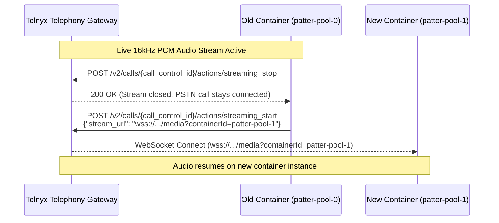

# Telnyx Mid-Call Resilience & Container Migration Architecture

> [!IMPORTANT]
> **Decoupled Call Control Rule**: In Telnyx Voice API v2, the **PSTN Call Leg** is completely decoupled from the **WebSocket Media Stream**. If a WebSocket drops or a container scales to zero, Telnyx **DOES NOT** hang up the customer's phone call.

---

## 1. Overview & Core Guarantees

Telnyx Call Control executes PSTN phone actions (`actions/answer`, `actions/hangup`, `actions/streaming_start`) via REST API calls, separate from real-time 16kHz PCM audio streaming.

| Scenario | Telnyx System Event | PSTN Phone Call Status | Customer Experience |
| :--- | :--- | :---: | :--- |
| **WebSocket Connection Drops** | `stream_stopped` callback sent | **ACTIVE (No Drop)** | Customer remains on line; audio resumes instantly on reconnect. |
| **Container Maintenance / Scale** | `streaming_stop` → `streaming_start` | **ACTIVE (No Drop)** | Mid-call audio re-routed to new container instance in < 100ms. |
| **User Presses Red Button** | `call.hangup` webhook sent | **TERMINATED** | Call ends naturally. |
| **Server Sends Hangup** | `actions/hangup` REST call | **TERMINATED** | Call ends via server command. |

---

## 2. Mid-Call Stream Migration Sequence

To migrate an active phone call between Cloudflare Durable Object containers (`patter-pool-0` → `patter-pool-1`) or regional data centers:



---

## 3. Session Hash Pinning in Edge Router

Our Cloudflare Worker Edge Router ([src/worker/index.ts](file:///Users/jamie/Herd/Patter-UtterPlus/src/worker/index.ts)) uses **Deterministic Session Hash Pinning** to ensure that any reconnected WebSocket attaches to the **exact same container DO instance**:

```typescript
// src/worker/index.ts
const callSessionId = url.searchParams.get("call_session_id") || url.searchParams.get("CallSid") || "";
let poolIndex = 0;

if (callSessionId) {
  let hash = 0;
  for (let i = 0; i < callSessionId.length; i++) {
    hash = (hash << 5) - hash + callSessionId.charCodeAt(i);
    hash |= 0;
  }
  poolIndex = Math.abs(hash) % configuredPoolSize;
}

const targetContainerId = `patter-pool-${poolIndex}`;
```

> [!NOTE]
> Even if a carrier WebSocket drops and reconnects 5 seconds later, the deterministic hash guarantees the carrier lands on `patter-pool-X` where the conversation state resides!

---

## 4. Financial & Pricing Verification

According to [Telnyx Voice API Pricing](https://telnyx.com/pricing/voice-api):

- **REST API Actions (`streaming_start` / `streaming_stop`)**: **$0.00 (FREE)**. No per-request fees for sending streaming control commands.
- **Media Streaming**: **$0.0035 / min** flat duration rate.
- **No Re-connection Surcharges**: Mid-call migrations (`streaming_stop` → `streaming_start`) do **NOT** reset minute rounding or charge setup fees. The single per-minute call meter runs continuously without financial penalty!
