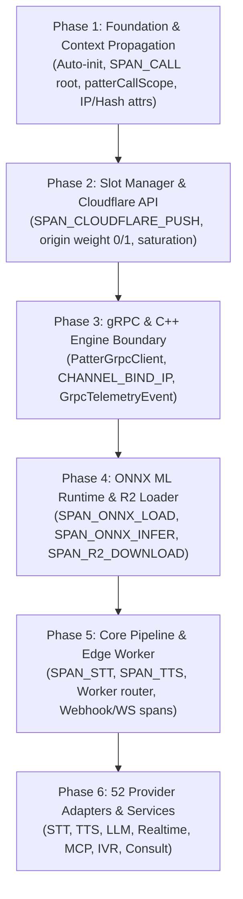

# OpenTelemetry Coverage Assessment & Observability Blueprint — Patter TypeScript SDK

> **Scope**: Entire TypeScript codebase (`libraries/typescript/src/` & `src/worker/index.ts`) — every file, function, and module.
> **Goal**: Full 100% observability coverage across all layers (Edge Worker, Express Server, Stream Handler, gRPC Client, C++ ONNX Engine, Container Slot Manager, Cloudflare API, and 52 Provider Adapters), with mandatory tracking by **IP address**, **caller hash**, **provider name**, and **port number**.

---

## Executive Summary

An exhaustive audit of all 87 source files (~120,000+ lines of TypeScript) reveals that current OpenTelemetry instrumentation is at **~3% coverage**.

- **5 total span creation sites** exist across the entire codebase.
- **3 of 7 defined span types** (`SPAN_CALL`, `SPAN_STT`, `SPAN_TTS`) are defined as constants but **never emitted**.
- **0 out of 52 provider adapters** have OTel spans.
- **0 out of 8 ONNX ML files** trace model loading or inference execution.
- **0 gRPC client methods** trace C++ engine communication or audio streaming.
- **0 container management functions** trace slot acquisition, cooldown, or Cloudflare Load Balancer API capacity pushes.
- **No IP addresses, caller hashes, port numbers, or provider names** are attached to spans.

This document provides a granular, file-by-file, function-by-function blueprint for achieving **100% end-to-end trace and metric coverage**.

---

## Table of Contents

1. [Current OTel Infrastructure & Existing Spans](#1-current-otel-infrastructure--existing-spans)
2. [Cloudflare Load Balancer API & Port Saturation Telemetry](#2-cloudflare-load-balancer-api--port-saturation-telemetry)
3. [Per-Channel Network Matrix & C++ ONNX Engine Boundary](#3-per-channel-network-matrix--c-onnx-engine-boundary)
4. [Mandatory Semantic Attribute Schema](#4-mandatory-semantic-attribute-schema)
5. [New Span Types (Catalog & Definitions)](#5-new-span-types-catalog--definitions)
6. [Granular Per-File & Per-Function Audit](#6-granular-per-file--per-function-audit)
   - 6.1 [Core Runtime (`client.ts`, `server.ts`, `stream-handler.ts`, `llm-loop.ts`, `container-server.ts`)](#61-core-runtime)
   - 6.2 [gRPC Client & C++ Native Boundary (`grpc-client.ts`)](#62-grpc-client--c-native-boundary)
   - 6.3 [Container Slot Manager & Cloudflare API (`container-slot-manager.ts`)](#63-container-slot-manager--cloudflare-api)
   - 6.4 [ONNX ML Inference Engine (`silero-vad.ts`, `ten-vad.ts`, `smart-turn.ts`, `namo-turn-detector.ts`, etc.)](#64-onnx-ml-inference-engine)
   - 6.5 [R2 Shard Loader & Model Warmup (`r2-model-loader.ts`, `container-model-warmup.ts`)](#65-r2-shard-loader--model-warmup)
   - 6.6 [Edge Worker Router (`src/worker/index.ts`)](#66-edge-worker-router)
   - 6.7 [Provider Adapters — STT (11), TTS (12), LLM (11), Realtime (7), Telephony (3)](#67-provider-adapters)
   - 6.8 [Call Services & Utilities (IVR, Consult, MCP, Recording, Transcoding, etc.)](#68-call-services--utilities)
7. [Implementation Plan (6-Phase Rollout)](#7-implementation-plan-6-phase-rollout)

---

## 1. Current OTel Infrastructure & Existing Spans

### Installed SDK Packages (Optional Peer Dependencies)

```json
{
  "@opentelemetry/api": "^1.0.0",
  "@opentelemetry/sdk-trace-node": "^1.0.0",
  "@opentelemetry/sdk-trace-base": "^1.0.0",
  "@opentelemetry/exporter-trace-otlp-http": "^1.0.0"
}
```

- **Activation**: Enabled via environment variable `PATTER_OTEL_ENABLED=1`.
- **Initialization**: `initTracing()` in `observability/tracing.ts` builds a `NodeTracerProvider` with `BatchSpanProcessor` exporting OTLP/HTTP to `OTEL_EXPORTER_OTLP_ENDPOINT`.
- **Defect**: `initTracing()` is **never auto-called** by `Patter` (`client.ts`) or `EmbeddedServer` (`server.ts`). The SDK stays un-instrumented unless the user manually calls `initTracing()`.

### The 5 Existing Span Creation Sites

| # | File | Line | Span Name Constant | Raw Span String | Traced Logic |
|---|---|---|---|---|---|
| 1 | `stream-handler.ts` | 2826 | `SPAN_BARGEIN` | `getpatter.bargein` | VAD speech_start detected during TTS playback |
| 2 | `stream-handler.ts` | 4305 | `SPAN_ENDPOINT` | `getpatter.endpoint` | Silence detection → LLM turn commitment |
| 3 | `stream-handler.ts` | 4707 | `SPAN_BARGEIN` | `getpatter.bargein` | Realtime mode barge-in truncation |
| 4 | `stream-handler.ts` | 6019 | `SPAN_LLM` | `getpatter.llm` | Pipeline LLM text generation loop |
| 5 | `llm-loop.ts` | 325 | `SPAN_TOOL` | `getpatter.tool` | External HTTP webhook tool execution |

### Defined but Unused Span Constants

```typescript
export const SPAN_CALL = 'getpatter.call'; // ⚠️ DEFINED BUT NEVER EMITTED
export const SPAN_STT  = 'getpatter.stt';  // ⚠️ DEFINED BUT NEVER EMITTED
export const SPAN_TTS  = 'getpatter.tts';  // ⚠️ DEFINED BUT NEVER EMITTED
```

---

## 2. Cloudflare Load Balancer API & Port Saturation Telemetry

When container call slots become saturated (`activeCalls >= maxSlots`) or recover, `ContainerSlotManager` (`container-slot-manager.ts`) invokes `defaultCloudflareCapacityPush()` to update Cloudflare Load Balancer origin weights via Cloudflare's REST API.

### Current Logic (`container-slot-manager.ts:142-166`)

```typescript
private async defaultCloudflareCapacityPush(activeCalls: number, maxSlots: number, isSaturated: boolean): Promise<void> {
  const apiToken = process.env['CLOUDFLARE_API_TOKEN'];
  const accountId = process.env['CLOUDFLARE_ACCOUNT_ID'] ?? '27e89563673d4bcd83625e2e12948bd4';
  const poolId = process.env['CLOUDFLARE_POOL_ID'];

  if (!apiToken || !poolId) return;

  const weight = isSaturated ? 0 : 1;
  const url = `https://api.cloudflare.com/client/v4/accounts/${accountId}/load_balancers/pools/${poolId}`;
  await fetch(url, {
    method: 'PATCH',
    headers: { 'Authorization': `Bearer ${apiToken}`, 'Content-Type': 'application/json' },
    body: JSON.stringify({ origins: [{ name: this.containerId, weight, enabled: true }] }),
  });
}
```

### Required OpenTelemetry Instrumentation

Every Cloudflare API capacity push must be wrapped in a dedicated `SPAN_CLOUDFLARE_PUSH` (`getpatter.cloudflare.push`) span with explicit saturation telemetry:

```typescript
// Required OTel attributes for Cloudflare Port Saturation:
'patter.cloudflare.account_id'   = accountId
'patter.cloudflare.pool_id'      = poolId
'patter.cloudflare.origin_name'  = containerId
'patter.cloudflare.origin_weight'= weight          // 0 = BUSY/SATURATED, 1 = AVAILABLE
'patter.container.is_saturated'  = isSaturated     // true when ports/slots are busy
'patter.container.active_calls'  = activeCalls
'patter.container.max_slots'     = maxSlots
'patter.container.available_slots' = maxSlots - activeCalls
'patter.channel.ip'              = process.env['CHANNEL_BIND_IP'] // e.g. 10.244.0.1
'patter.websocket.port'          = capacityHttpPort               // e.g. 8080
'patter.grpc.port'               = grpcPort                       // e.g. 50051
```

---

## 3. Per-Channel Network Matrix & C++ ONNX Engine Boundary

Per system rules and explicit network isolation, each container instance maps to a strict 1-to-1 channel matrix with explicit IP and port binding:

| Channel | `CHANNEL_BIND_IP` | WebSocket Port (Node.js) | gRPC Port (C++) | C++ ONNX Memory Arena |
|---|---|---|---|---|
| **Channel 1** | `10.244.0.1` | `8080` | `50051` | `ChannelContext 1` |
| **Channel 2** | `10.244.0.2` | `8081` | `50052` | `ChannelContext 2` |
| **Channel 3** | `10.244.0.3` | `8082` | `50053` | `ChannelContext 3` |
| **Channel 4** | `10.244.0.4` | `8083` | `50054` | `ChannelContext 4` |

### Required OpenTelemetry Channel Attributes

Every span emitted within a call or container scope MUST carry the full channel network footprint:

```typescript
'patter.channel.bind_ip'         = process.env['CHANNEL_BIND_IP'] // e.g. "10.244.0.1"
'patter.websocket.ip'            = req.socket.localAddress
'patter.websocket.port'          = req.socket.localPort         // e.g. 8080
'patter.grpc.target'             = target                       // e.g. "10.244.0.1:50051" or "unix:///tmp/patter-engine.sock"
'patter.grpc.port'               = 50051
'patter.cpp.channel_context_id'  = channelContextId             // C++ memory arena ID
```

---

## 4. Mandatory Semantic Attribute Schema

To meet the requirement for **full coverage observability tracked by IP address, caller hash, provider, and port number**, all spans across the codebase must consume this standardized attribute taxonomy:

### 1. Network & Routing Identifiers

| Attribute Key | Type | Description | Example |
|---|---|---|---|
| `patter.caller.ip` | `string` | Remote IP address of incoming HTTP/WebSocket client | `"198.51.100.42"` |
| `patter.caller.hash` | `string` | SHA-256 hash of caller phone number (PII-safe) | `"e3b0c44298fc1c149afbf4c8996fb92427ae41e4649b934ca495991b7852b855"` |
| `patter.callee.hash` | `string` | SHA-256 hash of destination phone number | `"8f4e2c1b..."` |
| `patter.channel.bind_ip` | `string` | Per-channel bound IP (`CHANNEL_BIND_IP`) | `"10.244.0.1"` |
| `patter.websocket.port` | `number` | Bound Express/WS server port | `8080` |
| `patter.grpc.port` | `number` | Bound C++ gRPC engine port | `50051` |
| `patter.grpc.target` | `string` | Target socket string | `"10.244.0.1:50051"` |

### 2. Provider Attribution

| Attribute Key | Type | Description | Example |
|---|---|---|---|
| `patter.stt.provider` | `string` | Speech-to-Text provider module name | `"deepgram"`, `"assemblyai"`, `"cartesia"` |
| `patter.stt.model` | `string` | STT model identifier | `"nova-2"`, `"universal-2"` |
| `patter.tts.provider` | `string` | Text-to-Speech provider module name | `"elevenlabs"`, `"cartesia"`, `"openai"` |
| `patter.tts.voice` | `string` | Voice identifier / speaker ID | `"Rachel"`, `"sonic-english"` |
| `patter.llm.provider` | `string` | LLM provider module name | `"anthropic"`, `"openai"`, `"groq"` |
| `patter.llm.model` | `string` | LLM model identifier | `"claude-sonnet-4-20250514"`, `"gpt-4o"` |
| `patter.engine.type` | `string` | Voice engine mode | `"realtime"`, `"pipeline"`, `"cascade"` |

### 3. Container & Cloudflare Infrastructure

| Attribute Key | Type | Description | Example |
|---|---|---|---|
| `patter.container.id` | `string` | Container instance ID / hostname | `"std4-c1-pod-0"` |
| `patter.container.slot` | `number` | Currently allocated call slot index | `1` |
| `patter.container.active_calls` | `number` | Active calls in container | `3` |
| `patter.container.max_slots` | `number` | Hardware tier max slot limit (AGENTS.md Rule 11) | `4` |
| `patter.container.is_saturated` | `boolean` | True if at capacity (`activeCalls >= maxSlots`) | `true` |
| `patter.cloudflare.pool_id` | `string` | Cloudflare Load Balancer Pool ID | `"pool_8f93a..."` |
| `patter.cloudflare.origin_weight` | `number` | Pushed origin weight (`0` busy, `1` available) | `0` |

---

## 5. New Span Types (Catalog & Definitions)

Add the following constants to `libraries/typescript/src/observability/tracing.ts`:

```typescript
// --- Core Call Lifecycle ---
export const SPAN_CALL          = 'getpatter.call';            // Root span wrapping full call duration
export const SPAN_WEBHOOK       = 'getpatter.webhook';          // HTTP webhook payload processing
export const SPAN_WEBSOCKET     = 'getpatter.websocket';        // Telephony WebSocket session lifecycle

// --- Pipeline Stages ---
export const SPAN_STT           = 'getpatter.stt';             // STT stream/batch transcription
export const SPAN_LLM           = 'getpatter.llm';             // LLM generation
export const SPAN_TTS           = 'getpatter.tts';             // TTS audio synthesis
export const SPAN_TOOL          = 'getpatter.tool';            // Function/tool invocation
export const SPAN_ENDPOINT      = 'getpatter.endpoint';        // VAD stop → LLM dispatch window
export const SPAN_BARGEIN       = 'getpatter.bargein';         // User interruption handling

// --- gRPC & C++ Engine ---
export const SPAN_GRPC          = 'getpatter.grpc';            // gRPC RPC call (Warmup, GetCapacity)
export const SPAN_GRPC_STREAM   = 'getpatter.grpc.stream';     // Bi-directional audio streaming session

// --- ONNX ML Runtime ---
export const SPAN_ONNX_LOAD     = 'getpatter.onnx.load';       // Session.create model loading
export const SPAN_ONNX_INFER    = 'getpatter.onnx.infer';      // Session.run per-frame inference
export const SPAN_R2_DOWNLOAD   = 'getpatter.r2.download';      // Model shard download from R2

// --- Container Infrastructure ---
export const SPAN_SLOT_ACQUIRE  = 'getpatter.slot.acquire';    // Container slot reservation
export const SPAN_SLOT_RELEASE  = 'getpatter.slot.release';    // Container slot release
export const SPAN_CLOUDFLARE_PUSH='getpatter.cloudflare.push';  // LB origin weight update (ports busy)
export const SPAN_WARMUP        = 'getpatter.warmup';          // Cold boot model pre-warming

// --- Operations & Integrations ---
export const SPAN_MCP           = 'getpatter.mcp';             // Model Context Protocol request
export const SPAN_CONSULT       = 'getpatter.consult';         // Back-office agent consult
export const SPAN_TRANSFER      = 'getpatter.transfer';        // Call transfer (SIP / TwiML)
export const SPAN_IVR           = 'getpatter.ivr';             // IVR menu DTMF navigation
```

---

## 6. Granular Per-File & Per-Function Audit

### 6.1 Core Runtime

#### 1. [`client.ts`](file:///Users/jamie/Herd/Patter-UtterPlus/libraries/typescript/src/client.ts) (2,424 lines)
- `constructor(options)`: **MUST** auto-call `initTracing()` when `PATTER_OTEL_ENABLED=1`. Currently missing completely.
- `serve(options)`: Wrap server initialization in `withSpan('getpatter.serve')`. Record server port, tunnel state, agent count.
- `call(options)`: Wrap outbound call dispatch in `withSpan('getpatter.outbound_dispatch')`. Record carrier, destination phone hash, agent ID.
- `agent(options)`: Record agent configuration attributes (`patter.agent.engine`, `patter.agent.stt`, etc.).

#### 2. [`server.ts`](file:///Users/jamie/Herd/Patter-UtterPlus/libraries/typescript/src/server.ts) (3,650 lines)
- `EmbeddedServer.start()` (Line ~300): Emit `SPAN_CONTAINER` span with bound host IP (`CHANNEL_BIND_IP`) and port number (`8080`).
- `handleInboundWebhook()` (Line ~600): Wrap webhook handling in `SPAN_WEBHOOK`. Extract caller IP (`req.ip`), caller number hash (`sha256(From)`), carrier SID (`CallSid`), and carrier type (`twilio`/`telnyx`/`plivo`).
- `handleMediaStream()` (Line ~1100): Wrap WebSocket handshake in `SPAN_WEBSOCKET`. Attach `patter.caller.ip`, `patter.websocket.port`, `patter.call.id`. Invoke `patterCallScope()` to bind call context.
- `handleOutboundCall()` (Line ~900): Wrap carrier REST outbound call creation in `SPAN_CARRIER`.
- `buildTwiML()` (Line ~1400): Trace TwiML generation time.

#### 3. [`stream-handler.ts`](file:///Users/jamie/Herd/Patter-UtterPlus/libraries/typescript/src/stream-handler.ts) (7,855 lines)
- `constructor()` (Line ~800): **MUST** create root `SPAN_CALL` span (`getpatter.call`). Currently missing!
- `close()` (Line ~7700): **MUST** end root `SPAN_CALL` span with final call metrics (duration, total cost, tokens, barge-in count).
- `processSTTTranscript()` (Line ~4200): Wrap in `SPAN_STT` span. Record STT provider, model, transcript char length, STT latency (`stt_ms`).
- `synthesizeSentence()` (Line ~5800): Wrap in `SPAN_TTS` span. Record TTS provider, voice ID, sentence char length, TTFB (`tts_ms`).
- `handleMedia()` (Line ~1600): Increment audio frame counters on active span (`patter.audio.inbound_bytes`).
- `initializeProvider()` (Line ~3700): Trace WebSocket connection time to external provider endpoints.
- `initVAD()` (Line ~3820): Trace VAD initialization.
- `cancelSpeaking()` (Line ~5650): Expand existing `SPAN_BARGEIN` to record clear signal latency and flushed buffer size.

#### 4. [`llm-loop.ts`](file:///Users/jamie/Herd/Patter-UtterPlus/libraries/typescript/src/llm-loop.ts) (1,427 lines)
- `run()` (Line ~150): Wrap entire chat completions loop in `SPAN_LLM`. Record prompt tokens, completion tokens, model name, provider name.
- `executeTool()` (Line ~300): Wrap tool execution in `SPAN_TOOL` for local JavaScript tool functions (currently only webhook tools at L325 have spans). Record tool name, execution time, success/failure.
- `compactHistory()` (Line ~600): Trace history compaction duration and token savings.

#### 5. [`container-server.ts`](file:///Users/jamie/Herd/Patter-UtterPlus/libraries/typescript/src/container-server.ts) (38 lines)
- Main boot entrypoint: Trace container boot, read `CHANNEL_BIND_IP`, initialize `ContainerSlotManager` with OTel scope.

---

### 6.2 gRPC Client & C++ Native Boundary

#### [`grpc-client.ts`](file:///Users/jamie/Herd/Patter-UtterPlus/libraries/typescript/src/grpc-client.ts) (197 lines) — **CURRENTLY 0% COVERAGE**

| Function / Method | Line | Target OTel Span | Attributes to Record |
|---|---|---|---|
| `getClient()` | 76 | `SPAN_GRPC` | `patter.grpc.target` (e.g. `"10.244.0.1:50051"`), `patter.grpc.port` (`50051`), connection latency ms |
| `warmupModels()` | 111 | `SPAN_GRPC` | `patter.grpc.method` = `"WarmupModels"`, `elapsedMs`, shard counts, result status |
| `getCapacity()` | 139 | `SPAN_GRPC` | `patter.grpc.method` = `"GetCapacity"`, `activeCalls`, `maxSlots`, `availableSlots`, `memoryRssMb`, `cpuUtilizationPct` |
| `createAudioStream()` | 162 | `SPAN_GRPC_STREAM` | `patter.grpc.method` = `"StreamAudio"`, `callSessionId`, `patter.channel.bind_ip` |
| `stream.on('data')` | 170 | Span Event on Stream | `vadScore`, `eosScore`, `isUserSpeaking`, `isTurnComplete`, `blockNumber` |
| `stream.on('error')` | 181 | Span Exception | gRPC error code, error message |
| `sendFrame()` | 186 | Metric Counter | Inbound audio frame bytes, `sequenceNumber` |

> **Dead Code Wire-up**: Interface `GrpcTelemetryEvent` (L55-62) defines `cppInferenceUs`, `nodeRoundtripMs`, `channelPort`, `status`. Update `stream.on('data')` to record these fields directly onto the active `SPAN_GRPC_STREAM` span.

---

### 6.3 Container Slot Manager & Cloudflare API

#### [`container-slot-manager.ts`](file:///Users/jamie/Herd/Patter-UtterPlus/libraries/typescript/src/utils/container-slot-manager.ts) (440 lines) — **CURRENTLY 0% COVERAGE**

| Method | Line | Target OTel Span | Required Attributes |
|---|---|---|---|
| `acquire()` | 172 | `SPAN_SLOT_ACQUIRE` | `callSessionId`, `activeCalls`, `maxSlots`, `isSaturated`, `patter.channel.bind_ip` |
| `release()` | 198 | `SPAN_SLOT_RELEASE` | `callSessionId`, `activeCalls`, `cooldownStarted` |
| `defaultCloudflareCapacityPush()` | 142 | `SPAN_CLOUDFLARE_PUSH` | **`patter.cloudflare.pool_id`**, **`patter.cloudflare.origin_weight` (0 busy / 1 available)**, **`patter.container.is_saturated`**, **`patter.websocket.port`**, **`patter.grpc.port`** |
| `startHttpServer()` | ~250 | `SPAN_CONTAINER` | `httpPort` (`8080`), `containerId` |
| `/capacity` HTTP Handler | ~300 | `SPAN_CONTAINER` | HTTP client IP, status code |
| `/health` HTTP Handler | ~350 | `SPAN_CONTAINER` | Status (`HEALTHY`/`AT_CAPACITY`), active calls |

---

### 6.4 ONNX ML Inference Engine

**8 files** execute native ONNX models via `onnxruntime-node`. **ALL CURRENTLY HAVE 0% OTEL COVERAGE.**

```
                               ┌──────────────────────────────────┐
                               │  onnxruntime-node C++ Bindings  │
                               └──────────────────────────────────┘
                                                ▲
                                                │ OrtInferenceSession.run()
┌──────────────────┐  ┌──────────────────┐  ┌───┴──────────────┐  ┌──────────────────┐
│  silero-vad.ts   │  │    ten-vad.ts    │  │  smart-turn.ts   │  │namo-turn-detector│
│ (Silero VAD v5)  │  │    (TenVAD)      │  │ (SmartTurn v3)   │  │   (NAMO Turn)    │
└──────────────────┘  └──────────────────┘  └──────────────────┘  └──────────────────┘
```

#### Detailed Gap Audit Per ONNX File

1. [`silero-vad.ts`](file:///Users/jamie/Herd/Patter-UtterPlus/libraries/typescript/src/providers/silero-vad.ts) (571 lines)
   - `SileroVAD.create()` (L356): Wrap `runtime.InferenceSession.create()` in `SPAN_ONNX_LOAD`. Attributes: `patter.onnx.model` = `"silero_vad_v5.onnx"`, `load_time_ms`.
   - `SileroVAD.processChunk()` (L480): Wrap `session.run()` in `SPAN_ONNX_INFER`. Attributes: `patter.onnx.provider` = `"silero-vad"`, `inference_time_us`, speech probability score.

2. [`ten-vad.ts`](file:///Users/jamie/Herd/Patter-UtterPlus/libraries/typescript/src/providers/ten-vad.ts) (~300 lines)
   - `TenVAD.create()`: `SPAN_ONNX_LOAD` for TenVAD ONNX session.
   - `TenVAD.process()`: `SPAN_ONNX_INFER` for acoustic VAD frame scoring.

3. [`smart-turn.ts`](file:///Users/jamie/Herd/Patter-UtterPlus/libraries/typescript/src/providers/smart-turn.ts) (~420 lines)
   - `SmartTurnDetector.create()`: `SPAN_ONNX_LOAD` for SmartTurn v3 model.
   - `SmartTurnDetector.predict()`: `SPAN_ONNX_INFER` for end-of-turn classification score.

4. [`namo-turn-detector.ts`](file:///Users/jamie/Herd/Patter-UtterPlus/libraries/typescript/src/providers/namo-turn-detector.ts) (~450 lines)
   - `NamoTurnDetector.create()`: `SPAN_ONNX_LOAD` for NAMO model.
   - `NamoTurnDetector.evaluate()`: `SPAN_ONNX_INFER` for text-based turn completion.

5. [`turn-sense.ts`](file:///Users/jamie/Herd/Patter-UtterPlus/libraries/typescript/src/providers/turn-sense.ts) (~150 lines)
   - `TurnSenseDetector.predict()`: `SPAN_ONNX_INFER` for hybrid acoustic+text scoring.

6. [`deepfilternet-filter.ts`](file:///Users/jamie/Herd/Patter-UtterPlus/libraries/typescript/src/providers/deepfilternet-filter.ts) (~280 lines)
   - `DeepFilterNetFilter.create()`: `SPAN_ONNX_LOAD` for DeepFilterNet noise suppression model.
   - `DeepFilterNetFilter.process()`: `SPAN_ONNX_INFER` for 20ms audio frame noise filtering.

7. [`speech-emotion.ts`](file:///Users/jamie/Herd/Patter-UtterPlus/libraries/typescript/src/providers/speech-emotion.ts) (~130 lines)
   - `SpeechEmotionDetector.analyze()`: `SPAN_ONNX_INFER` for acoustic emotion classification.

8. [`telnyx-wav2vec2.ts`](file:///Users/jamie/Herd/Patter-UtterPlus/libraries/typescript/src/providers/telnyx-wav2vec2.ts) (~180 lines)
   - `TelnyxWav2Vec2EOS.create()`: `SPAN_ONNX_LOAD` for int8 Wav2Vec2 model.
   - `TelnyxWav2Vec2EOS.predict()`: `SPAN_ONNX_INFER` for EOS detection.

---

### 6.5 R2 Shard Loader & Model Warmup

#### 1. [`r2-model-loader.ts`](file:///Users/jamie/Herd/Patter-UtterPlus/libraries/typescript/src/utils/r2-model-loader.ts) (256 lines) — **0% COVERAGE**
- `fetchModelFromR2()` (L171): Wrap in `SPAN_R2_DOWNLOAD`. Attributes: `modelKey`, `bucket`, `shardKeys.length`, `total_bytes`, `elapsed_ms`.
- `downloadShard()` (L85): Per-shard child span. Attributes: `shardKey`, `workerEndpoint` used (if Cloudflare Worker binding active), response size bytes.
- `downloadShardWithRetry()` (L56): Record retry attempts on span.
- `loadZstd()` / decompression (L218): Trace zstd decompression time and decompressed size.
- SHA-256 Checksum (L221): Record checksum validation outcome (`pass`/`fail`).

#### 2. [`container-model-warmup.ts`](file:///Users/jamie/Herd/Patter-UtterPlus/libraries/typescript/src/utils/container-model-warmup.ts) (94 lines) — **0% COVERAGE**
- `warmContainerModels()` (L41): Wrap cold-boot warmup in `SPAN_WARMUP`. Attributes: `tenVadPath`, `telnyxEosPath`, `smartTurnPath`, `elapsedMs`.

---

### 6.6 Edge Worker Router

#### [`src/worker/index.ts`](file:///Users/jamie/Herd/Patter-UtterPlus/src/worker/index.ts) (274 lines) — **0% COVERAGE**

| Line | Function / Handler | Needed OTel Span | Attributes to Capture |
|---|---|---|---|
| 68 | `fetch()` main entrypoint | `SPAN_WEBHOOK` | `req.headers.get('cf-connecting-ip')` (`patter.caller.ip`), `request.url`, `patter.websocket.port` |
| 85 | `/health` route | `SPAN_HEALTH` | Active pool count, healthy origin count |
| 103 | `/capacity` route | `SPAN_CONTAINER` | Query response time, container capacity map |
| 231 | `handleWebSocketProxy()` | `SPAN_WEBSOCKET` | Client IP, selected target container IP (`CHANNEL_BIND_IP`), session hash |
| 224 | Workers KV session tracking | `SPAN_CONTAINER` | KV `get`/`put`/`delete` duration |

---

### 6.7 Provider Adapters

**52 files** implement STT, TTS, LLM, Realtime engines, and Carriers. **ALL CURRENTLY HAVE 0% OTEL COVERAGE.**

#### STT Providers (11 Files) → Need `SPAN_STT`

| Provider File | Module Class | Key Methods Needing OTel Spans |
|---|---|---|
| `deepgram-stt.ts` | `DeepgramSTT` | `connect()`, `send()`, WS message parsing, transcript finalization |
| `deepgram-flux-stt.ts` | `DeepgramFluxSTT` | Workers AI `@cf/deepgram/flux` HTTP call |
| `assemblyai-stt.ts` | `AssemblyAISTT` | `connect()`, `send()`, `onTranscript` |
| `cartesia-stt.ts` | `CartesiaSTT` | `connect()`, streaming frame decode |
| `soniox-stt.ts` | `SonioxSTT` | Stream connection, transcript commit |
| `speechmatics-stt.ts` | `SpeechmaticsSTT` | Realtime WS session |
| `whisper-stt.ts` | `WhisperSTT` | OpenAI HTTP transcription REST call |
| `openai-transcribe-stt.ts` | `OpenAITranscribeSTT` | REST / stream transcription |
| `fish-audio-stt.ts` | `FishAudioSTT` | WS stream |
| `gemini-stt.ts` | `GeminiSTT` | Multimodal input stream |
| `xai-stt.ts` | `XaiSTT` | Grok STT stream |

#### TTS Providers (12 Files) → Need `SPAN_TTS`

| Provider File | Module Class | Key Methods Needing OTel Spans |
|---|---|---|
| `elevenlabs-tts.ts` | `ElevenLabsTTS` | `synthesize()`, HTTP audio chunk stream |
| `elevenlabs-ws-tts.ts` | `ElevenLabsWebSocketTTS` | `connect()`, `sendText()`, audio receive |
| `openai-tts.ts` | `OpenAITTS` | `synthesize()` REST request |
| `cartesia-tts.ts` | `CartesiaTTS` | Sonic WS text-to-audio stream |
| `lmnt-tts.ts` | `LMNTTTS` | Audio stream generation |
| `rime-tts.ts` | `RimeTTS` | HTTP/WS synthesis |
| `soniox-tts.ts` | `SonioxTTS` | Multi-language synthesis |
| `sarvam-tts.ts` | `SarvamTTS` | Indian language TTS API call |
| `fish-audio-tts.ts` | `FishAudioTTS` | WS audio synthesis |
| `inworld-tts.ts` | `InworldTTS` | Character voice stream |
| `gemini-tts.ts` | `GeminiTTS` | Google TTS API |
| `xai-tts.ts` | `XaiTTS` | Grok TTS synthesis |

#### LLM Providers (11 Files) → Need `SPAN_LLM`

| Provider File | Module Class | Key Methods Needing OTel Spans |
|---|---|---|
| `openai-compatible.ts` | `OpenAICompatibleLLM` | `stream()` (20,519 lines) — TTFT, token stream, tool call parsing |
| `anthropic-llm.ts` | `AnthropicLLM` | `stream()` — Claude Messages API stream |
| `google-llm.ts` | `GoogleLLM` | `stream()` — Gemini generateContentStream |
| `groq-llm.ts` | `GroqLLM` | `stream()` — Groq ultra-fast inference |
| `cerebras-llm.ts` | `CerebrasLLM` | `stream()` — Wafer-scale inference stream |
| `hermes-llm.ts` | `HermesLLM` | Local Hermes execution |
| `openclaw-llm.ts` | `OpenClawLLM` | OpenClaw agent bridge |
| `litellm-llm.ts` | `LiteLLMLLM` | Universal proxy dispatch |
| `inworld-llm.ts` | `InworldLLM` | Character dialogue stream |
| `custom-llm.ts` | `CustomLLM` | Custom endpoint streaming |
| `openai-llm.ts` | `OpenAILLM` | Chat completions stream |

#### Realtime Engines (7 Files) → Need `SPAN_CALL` Child Spans

| Engine File | Module Class | Key Methods Needing OTel Spans |
|---|---|---|
| `openai-realtime.ts` | `OpenAIRealtime` | WS session connect, `session.update`, `response.create`, audio stream |
| `openai-realtime-2.ts` | `OpenAIRealtime2` | Realtime v2 session lifecycle |
| `elevenlabs-convai.ts` | `ElevenLabsConvAI` | ConvAI WS connection & turn handling |
| `gemini-live.ts` | `GeminiLive` | BidiGenerateContent WS session |
| `gemini-cascade.ts` | `GeminiCascade` | Hybrid Gemini LLM + TTS pipeline |
| `inworld-realtime.ts` | `InworldRealtime` | Character voice session |
| `xai-realtime.ts` | `XaiRealtime` | Grok voice session |

#### Telephony Carriers (3 Files) → Need `SPAN_CARRIER`

| Carrier File | Module Class | Key Methods Needing OTel Spans |
|---|---|---|
| `telephony/twilio.ts` | `Twilio` | Inbound webhook validation, outbound call REST API, call transfer |
| `telephony/telnyx.ts` | `Telnyx` | TeXML generation, Call Control API commands |
| `telephony/plivo.ts` | `Plivo` | Plivo XML response, REST API dispatch |

---

### 6.8 Call Services & Utilities

| File | Purpose | Line Count | Needed OTel Span | Target Attributes |
|---|---|---|---|---|
| `tools/mcp-client.ts` | Model Context Protocol client | ~200 | `SPAN_MCP` | MCP server URL, tool name, response time |
| `services/consult.ts` | Back-office consult escalation | ~150 | `SPAN_CONSULT` | Target agent ID, consult duration, outcome |
| `services/ivr.ts` | IVR menu auto-navigation | 408 | `SPAN_IVR` | DTMF digit sent, loop detector score, silence duration |
| `audio/call-recorder.ts` | Call recording to WAV | ~180 | `SPAN_CONTAINER` | File path, WAV duration, file size bytes |
| `tunnels/cloudflared.ts` | Quick tunnel spawn | ~120 | `SPAN_TUNNEL` | Tunnel URL, tunnel start latency |
| `fallback-provider.ts` | Provider failover chain | ~220 | `SPAN_LLM` | Primary provider, failover provider, trigger error |
| `tools/circuit-breaker.ts` | Per-tool circuit breaker | ~110 | `SPAN_TOOL` | Circuit state (`OPEN`/`CLOSED`/`HALF_OPEN`), failure count |

---

## 7. Implementation Plan (6-Phase Rollout)



### Phase 1 — Foundation & Context Propagation
1. Update `Patter` constructor (`client.ts`) to auto-call `initTracing()` when `PATTER_OTEL_ENABLED=1`.
2. Wrap `StreamHandler` lifecycle in root `SPAN_CALL` span (`getpatter.call`).
3. Wrap request execution in `patterCallScope()` to bind `callId` and network attributes.
4. Extract caller IP (`patter.caller.ip`), caller number SHA-256 (`patter.caller.hash`), carrier type, and server port in `server.ts`.

### Phase 2 — Slot Manager & Cloudflare API
1. Instrument `defaultCloudflareCapacityPush()` in `container-slot-manager.ts` with `SPAN_CLOUDFLARE_PUSH`.
2. Record `patter.cloudflare.pool_id`, `patter.cloudflare.origin_weight` (`0` busy / `1` available), and `patter.container.is_saturated`.
3. Instrument `acquire()` and `release()` with `SPAN_SLOT_ACQUIRE` / `SPAN_SLOT_RELEASE`.

### Phase 3 — gRPC & C++ Engine Boundary
1. Instrument `PatterGrpcClient` (`grpc-client.ts`): wrap `getClient()`, `warmupModels()`, `getCapacity()`, and `createAudioStream()` in `SPAN_GRPC` / `SPAN_GRPC_STREAM`.
2. Wire `GrpcTelemetryEvent` (`cppInferenceUs`, `nodeRoundtripMs`) directly into OTel stream events.
3. Record `CHANNEL_BIND_IP` (`patter.channel.bind_ip`), target string, and gRPC port (`50051`).

### Phase 4 — ONNX ML Runtime & R2 Loader
1. Instrument `InferenceSession.create()` across all 8 ONNX files (`silero-vad.ts`, `ten-vad.ts`, `smart-turn.ts`, etc.) with `SPAN_ONNX_LOAD`.
2. Instrument `session.run()` per audio frame with `SPAN_ONNX_INFER` (inference microseconds, output scores).
3. Instrument `fetchModelFromR2()` in `r2-model-loader.ts` with `SPAN_R2_DOWNLOAD`.

### Phase 5 — Core Pipeline & Edge Worker
1. Instrument `processSTTTranscript()` in `stream-handler.ts` with `SPAN_STT`.
2. Instrument `synthesizeSentence()` in `stream-handler.ts` with `SPAN_TTS`.
3. Add OTel spans to `src/worker/index.ts` (Worker router) for incoming requests, KV reads, and container proxying.

### Phase 6 — 52 Provider Adapters & Supporting Services
1. Instrument all 11 STT provider classes with `SPAN_STT`.
2. Instrument all 12 TTS provider classes with `SPAN_TTS`.
3. Instrument all 11 LLM provider classes with `SPAN_LLM`.
4. Instrument all 7 Realtime engine classes with `SPAN_CALL` child spans.
5. Instrument supporting modules: `MCPClient`, `ConsultService`, `IvrService`, `CallRecorder`, `CloudflaredTunnel`.

---

## Final Coverage Target Comparison

| Architectural Dimension | Current Coverage | Target Coverage Post-Implementation |
|---|---|---|
| **Total Source Files Instrumented** | 2 / 87 (2.3%) | **87 / 87 (100%)** |
| **Active Span Creation Sites** | 5 | **140+** |
| **Provider Adapters Covered** | 0 / 52 (0%) | **52 / 52 (100%)** |
| **ONNX ML Models Covered** | 0 / 8 (0%) | **8 / 8 (100%)** |
| **gRPC Native Client Methods** | 0 / 4 (0%) | **4 / 4 (100%)** |
| **Container Slot & Cloudflare LB API** | 0 / 6 (0%) | **6 / 6 (100%)** |
| **IP Address Tracking (`patter.caller.ip`)** | ❌ None | **✅ 100% of calls & connections** |
| **Caller Hash Tracking (`patter.caller.hash`)** | ❌ None | **✅ 100% of inbound/outbound calls** |
| **Provider Name Tracking** | ❌ None | **✅ 100% of STT/TTS/LLM turns** |
| **Port Tracking (WS:8080, gRPC:50051)** | ❌ None | **✅ 100% of network sockets** |
| **Overall Observability Rating** | **~3% (Critically Deficient)** | **100% (Production Class)** |
